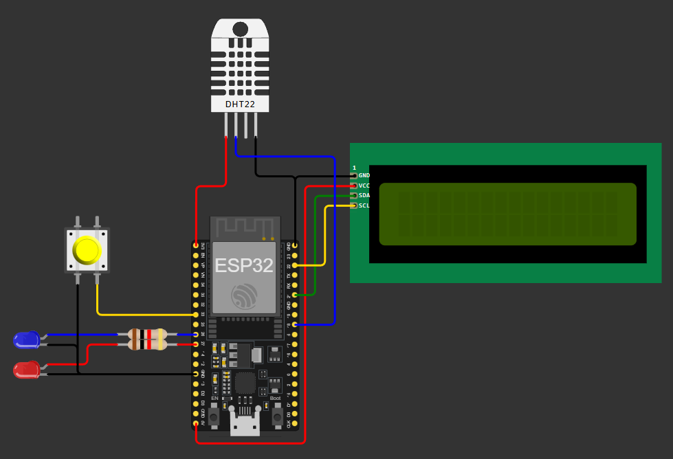
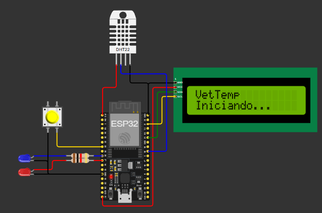
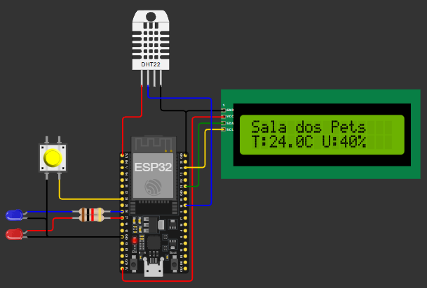
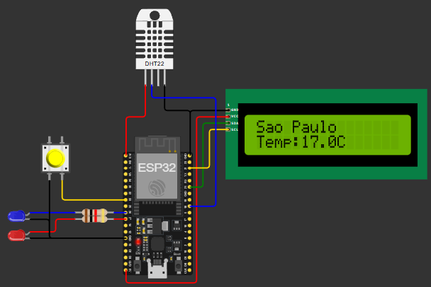
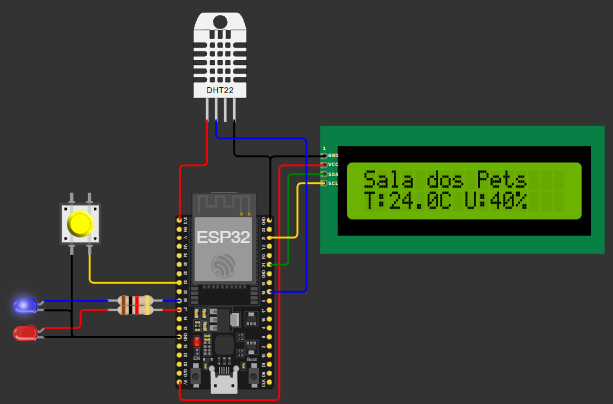
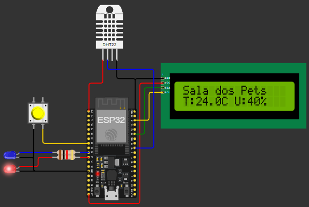

# ChupinVet - VetTemp

## INFORMAÇÕES DO GRUPO

**Nome:** Agatha Yie Won Yun  
**RM:** 561507  
**Turma:** 2TDSA

**Nome:** Ana Claudia Fernandes Martins  
**RM:** 561190  
**Turma:** 2TDSR

**Nome:** Anabelle Rosseto Rodrigues  
**RM:** 564526  
**Turma:** 2TDSR

**Nome:** Samantha Faruolo Galdi  
**RM:** 554794  
**Turma:** 2TDSA

**Nome:** Vitor Fria Dalmagro  
**RM:** 566052  
**Turma:** 2TDSA

---
## Sobre o VetTemp

A proposta desse projeto é um **monitor de temperatura para a sala dos pets em clínicas veterinárias**. O projeto utiliza um ESP32 com sensor DHT22 para realizar a leitura da temperatura e umidade do ambiente, mostra essas informações em um LCD, usa LEDs para alerta de Frio (Led Azul) e Calor (Led Vermelho), pega temperatura de São Paulo por API e ainda cria uma API própria em /api/status.

# Objetivo do Projeto

O objetivo do projeto é oferecer um monitoramento simples e inteligente do ambiente onde os animais permanecem, ajudando o veterinário a identificar situações de frio ou calor excessivo na sala dos pets.

# Funcionalidades

- Leitura de temperatura e umidade da sala
- Exibição das informações no LCD/OLED
- Consulta da temperatura externa de São Paulo via API
- Alternância de telas utilizando botão
- LED azul para alerta de frio
- LED vermelho para alerta de calor
- API REST local utilizando ESP32

## Hardware utilizado

O circuito do projeto é o seguinte:



## Instruções de Uso

1. Clonar o repositório
- git clone https://github.com/ChupinVet/VetTemp_IoT.git
- cd VetTemp_IoT
- code .

2. Rodar o código no Arduino
- Abra o vettemp.ino no Arduino
- Instale as bibliotecas no Arduino
- Vá em Sketch > Export Compiled Binary

3. Rodar no VScode
- Depois que compilado, volte ao VsCode e abra o Diagram.json
- Configure sua Wokwi License Key
- Execute o simulador no botão verde

3. Como Funciona?
- Logo que iniciado, na tela LCD aparece a mensagem "VetTemp Iniciando..."
- Logo após, aparecerá as informações de Temperatura(C) e Umidade(U) no LCD
- O botão muda entre a tela de temperatura da sala e entre a temperatura externa (SP)
- **Sobre os leds:**
    - Quando a temperatura está acima de 29 C° o led vermelho pisca
    - Quando a temperatura está abaixo de 18 C° o led azul pisca

## Tecnologias Utilizadas

- C++
- Arduino IDE
- ESP32
- Wokwi
- API Open-Meteo
- WebServer
- JSON
- HTTP Requests

# Estrutura do Projeto

```text
VETTEMP_IOT
│
├── vettemp
|   └── diagram.json
|   └── vetemp.ino
|   └── wokwi.toml
├── .gitignore
├── image.png
└── README.md

## Resultados Parciais

- O projeto conseguiu:
    - realizar leitura de temperatura e umidade em tempo real
    - consumir dados externos via API
    - criar uma API REST utilizando ESP32
    - integrar hardware e software em um sistema IoT funcional

- Tela inicial

- Temperatura da Sala dos Pets

- Temperatura externa (SP)

- Led Azul (Frio)

- Led Vermelho (Calor)
